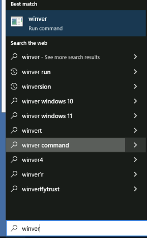

# Notes

## New hire

<figure><figcaption></figcaption></figure>

* To asign an office go to -> properties
* To assign a title go to -> properties -> Organization

## Create a Group in AD

It is the same as creating a new user.&#x20;

* Difference between Security Group and Distribution group: distribution group is mostly for information purposes

## Create an Organizational Unit

<figure><figcaption></figcaption></figure>

## Account Lockout

<figure><figcaption></figcaption></figure>

## Reset the password and unlock account

<figure><figcaption></figcaption></figure>

## Disabling Accounts

<figure><figcaption></figcaption></figure>
