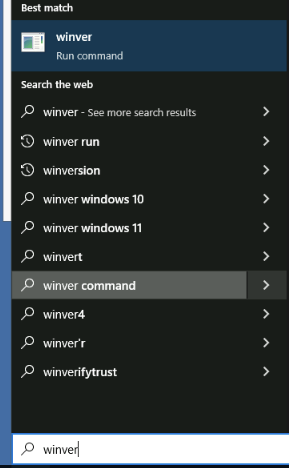

# Project 1


<figure><figcaption></figcaption></figure>

Next, name it, next. Select 4 GB of ram. Select 35GB of disk

<figure><figcaption></figcaption></figure>

<figure><figcaption></figcaption></figure>

Start And Connect


<figure><figcaption></figcaption></figure>

* We will get an error, We have click repair your computer

<figure><figcaption></figcaption></figure>

Command Prompt

```powershell
regedit
```

<figure><figcaption><p>setup</p></figcaption></figure>

<figure><figcaption></figcaption></figure>

Name it: `BypassTPMCheck`

Modify -> Change the value from 0 to 1

<figure><figcaption></figcaption></figure>

Create another one with the name of `BypassSecureBootCheck`

&#x20;Modify the value data from 0 to 1

DON'T CLOSE EVERYTHING. Type `setup` on the command line


<figure><figcaption></figcaption></figure>
